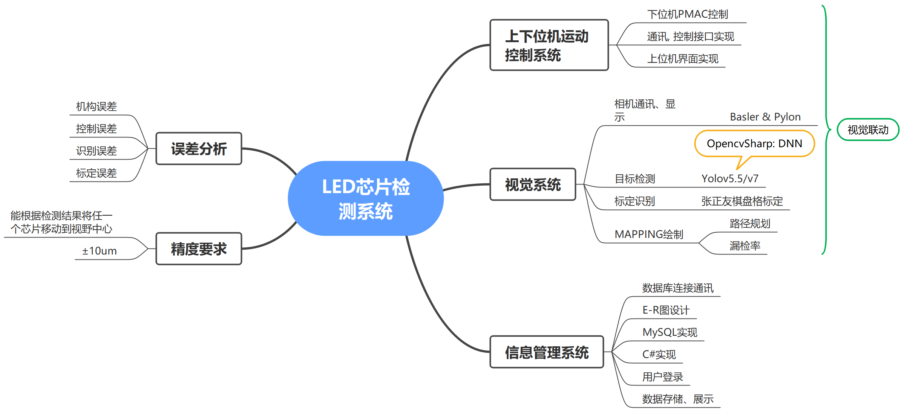

# 上位机测试软件    
### 晶粒MAPPING图以及数据库信息管理   

---  
#### **Key Word**:   `C#`,`PMAC`,`UpComputer`,`LED芯片检测`,`MAPPING`,`MySQL`,`YOLOv5/v7`.    

---  
**说明**：使用C#进行上位机编程，与PMAC通讯，控制XY轴进行运动，实现Jog运动、位置速度读取显示等；与Basler相机通讯连接，采集芯片盘上的芯片；进行目标检测，得到晶粒像素位置参数；由像素坐标得到世界坐标进行控制轴动；规划移动路径，扫描整个芯片盘得到晶粒的分布；存储每个芯片信息，这里为位置信息以及操作者的用户信息。（Tips:学校的项目，且做记录,QaQ做的实在不怎么样，只是刚好简单实现相应功能hh，还是做得很low。)  

**实现内容**：
- 上位机实现：C#上位机与PMAC卡通讯
- 视觉标定、目标检测
- 视觉联动控制
- MAPPING图绘制
- 数据存储 (MySQL)

--- 
**目录**：
- [1. 需求分析](#1-需求分析)  
- [2. 系统框架](#2-系统框架)  
- [3. 上位机控制实现](#3-上位机控制实现)  
- [4. 目标检测实现 ](#4-目标检测实现)  
- [5. 标定实现](#5-标定实现)  
- [6. MAPPING实现](#6-MAPPING实现)  
- [7. 数据存储](#7-数据存储)  

---  
## 1 需求分析
- 项目内容：在工业精密级的平台上完成芯片检测设备基本软件管理，实现MAPPING图以及数据库芯片数据管理。  
- 分为三部分内容：视觉联动控制、MAPPING图绘制、数据库管理系统。  
- 视觉联动控制：
    - 实现相机标定，完成像素坐标到机床坐标的转换；
    - 完成目标检测，识别出摄像头拍摄到的各个芯片的中心坐标；
    - 实现上下位机的运动控制，与PMAC进行通讯，控制其对应轴进行运动；
- MAPPING图绘制：路径规划，将芯片盘上所有正常芯片的分布情况进行检测，并且实现获得每一个芯片的机床坐标，得到其映射图；
- 数据库管理系统：
    - 实现用户的登录、创建、登出；
    - 完成E-R图的设计，存储操作者、日期、芯片id、机床坐标等信息；
    - 实现数据的查询、显示。

## 2 系统框架  
  

## 3 上位机控制实现    
- **调用Pcommserver.dll对PMAC卡进行控制。**  
- 基本实现方式详细见: [PMAC CSharp 在C#中控制PMAC](https://github.com/lin-tea/PMAC_CSharp)  
(回零功能未加入)
- 优化：封装,PNAC类

## 4 目标检测实现  
- 基本实现方式详细见: [YOLOv5 Detection With CSharp](https://github.com/lin-tea/YOLOv5DetectionWithCSharp)  
(使用[yolov7](https://github.com/WongKinYiu/yolov7)同样)  
- 优化：封装,Detect类  

## 5 标定实现  

## 6 MAPPING实现  

## 7 数据存储

---  
## 参考 

[1].[参考1](https://www.baidu.com)   
[2].[参考2]()  